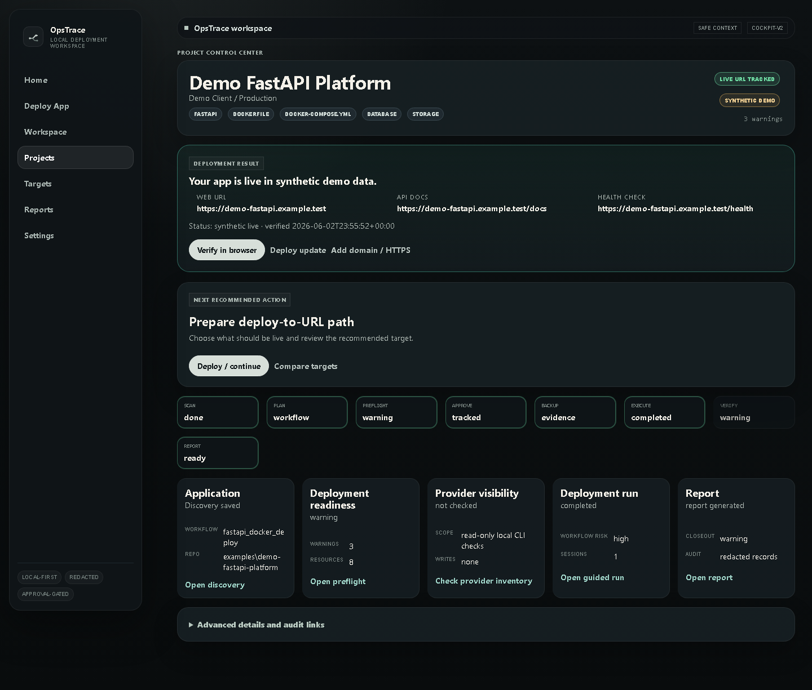
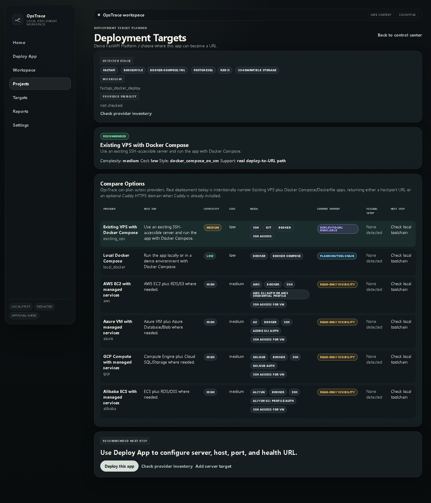
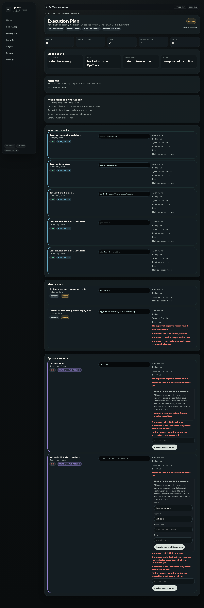
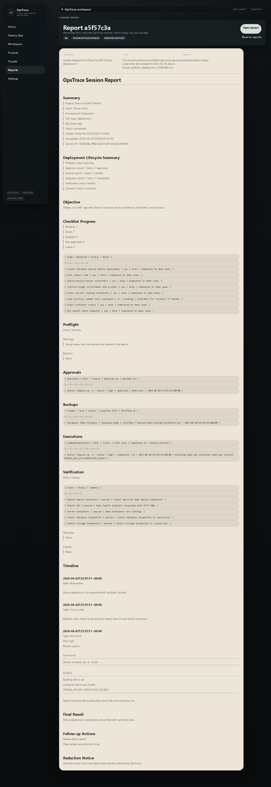

# OpsTrace Case Study

OpsTrace is a local-first deployment workspace for engineers and builders who need to move an application from a local repository to a reachable deployment URL with clearer checks, approvals, and evidence.

The source code is private. This repository documents the product, architecture, safety model, and engineering decisions behind the project.

## Proof Links

- Portfolio walkthrough: [anasnaveed.com/case-studies/opstrace.html](https://anasnaveed.com/case-studies/opstrace.html)
- Source status: private, documented here with screenshots and architecture notes
- Best proof signal: backend-heavy deployment workflow, readiness checks, guarded execution, redaction, and audit reporting

## 60-Second Reviewer Check

If you are reviewing this for a backend, DevOps, internal tooling, or AI workflow role, check these first:

- The screenshots show a real product surface: control center, target planner, execution plan, and deployment report
- The workflow is specific: scan a project, plan a deployment target, run readiness checks, require approval, execute a narrow path, verify the endpoint, and save an audit report
- The safety model is not decorative: secrets stay local, AI receives redacted context, risky steps require approval, and unsupported paths are blocked
- The backend scope is visible: CLI, FastAPI local UI, SQLite state, project scanning, Docker and Compose detection, SSH inspection, report generation, and policy checks

This is not open source. Treat it as a public case study with product screenshots and architecture evidence.

## Screenshots

| Control center | Target planner |
| --- | --- |
|  |  |

| Execution plan | Deployment report |
| --- | --- |
|  |  |

## Problem

Deployments often fail for boring reasons: missing environment variables, unclear server state, undocumented commands, weak rollback notes, and no clean record of what happened. This is especially painful for small teams, freelancers, and AI-assisted builders who need deployment support without handing secrets or production access to an external agent.

OpsTrace was built around a simple goal: help a developer get from an app repo to a verified URL while keeping credentials local and making every risky step visible.

## What I Built

- Local CLI and web dashboard for deployment planning and operational workflows
- Project scanner for frameworks, Docker files, Compose files, env hints, health checks, and deployment signals
- Deployment target planner for existing VPS, local Docker, and cloud planning paths
- Guided deployment sessions with readiness checks, approvals, execution records, and reports
- Read-only inspectors for SSH servers, PostgreSQL databases, S3-compatible storage, and cloud account visibility
- Redaction and policy checks before AI receives project or deployment context
- MCP context bridge exposing safe project/session/report context to local AI clients

## What A Reviewer Can Verify Here

- The product has a concrete workflow, not just a vague AI assistant claim
- The UI covers project control, target planning, execution planning, and reporting
- The architecture separates scanning, planning, readiness, execution, verification, and endpoint records
- The safety model is explicit: local credentials, redaction, approvals, and narrow allowed operations
- The project maps directly to backend, DevOps, internal tooling, and practical AI workflow roles

## Architecture

```text
Local project
  -> workspace scanner
  -> project profile
  -> target planner
  -> readiness checks
  -> guarded execution path
  -> verification
  -> deployment endpoint
  -> audit report
```

Core components:

- Python CLI using Typer
- FastAPI and Jinja local UI
- SQLite local storage
- OS keychain references for secrets
- Read-only provider and server inspectors
- Policy engine for allowed operations
- Redacted report and session logs

## Safety Model

OpsTrace is intentionally conservative.

- Secret values stay local
- Real `.env` values are not exposed to AI context
- Provider and command outputs are redacted before storage
- Unsupported actions are blocked instead of guessed
- Cloud provider paths are planning and visibility only unless a guarded write path exists
- Execution is limited to narrow, approved deployment operations

## Engineering Decisions

The project is designed as a local operations tool instead of a hosted SaaS. That decision keeps credentials close to the user, reduces trust requirements, and makes the system suitable for solo developers or small teams managing client deployments.

The AI layer is treated as a planner and reviewer, not an unrestricted operator. It receives sanitized context and produces recommendations, while actual execution remains controlled by policy checks and explicit approvals.

## What I Owned

- Product flow from project discovery to deployment report
- Backend architecture and local storage model
- CLI workflows and local dashboard
- Repository scanning and deployment signal detection
- Read-only infrastructure inspectors
- Redaction, policy checks, and approval flows
- Technical positioning, README, and demo flow

## Tech

- Python
- FastAPI
- Typer
- SQLite
- Jinja
- Docker and Docker Compose workflows
- SSH inspection
- PostgreSQL inspection
- S3-compatible storage inspection
- MCP server integration

## Results

OpsTrace demonstrates my ability to build backend-heavy operational software with real-world constraints: secrets, deployment risk, local tooling, user trust, and production evidence.

It is strongest as proof of systems thinking, backend architecture, developer tooling, and practical AI workflow design.
